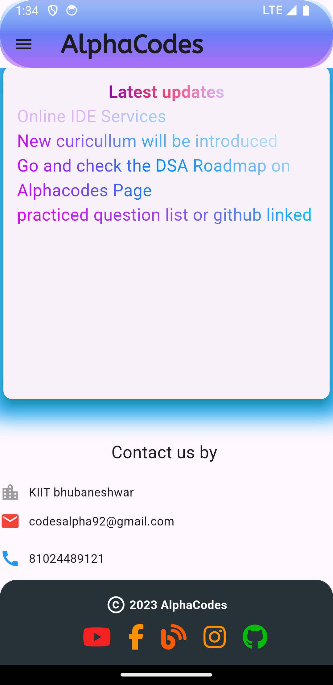

## Alpha Codes Logo

# Alpha Codes

Hey There This is me Rehyan yadav, this App Alpha Codes is basically the app  for
learning programming language with notes and roadmaps this app will help you to enhances your programming knowleges. This app will soon providing services like It consultancy,  tech solution ,project building , hire us for work etc 

## Features

- Light/dark mode toggle
- Live previews
- Fullscreen mode
- Cross platform

## Authors

- [@rehyanyadav](https://www.linkedin.com/in/rehyanyaduvanshi/)

## Tech Stack

**Client:** Flutter ,javascript 

**Server:** dart , firebase ,javascript , node 

## Used By

This project is used by the :

- Alpha codes 

## Demo

 https://rehyanyadav.github.io/alphapages.github.io/
## Badges

Add badges from somewhere like: [shields.io](https://shields.io/)

## Feedback

If you have any feedback, please reach out to us at 
codesalpha92@gmail.com

